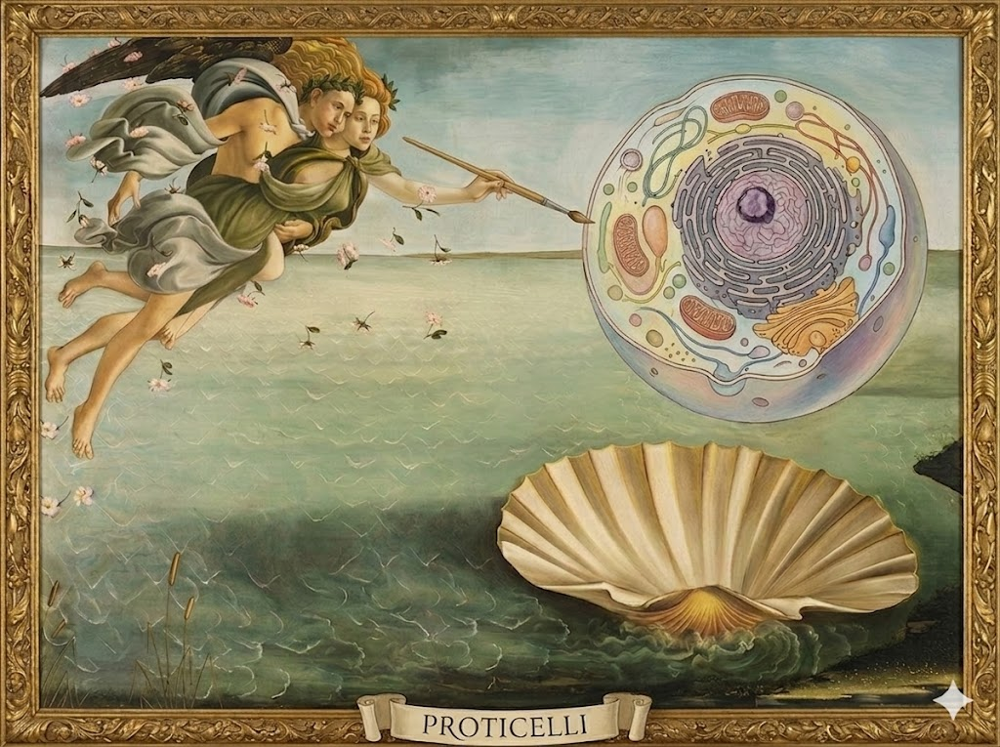

# ProtiCelli

**ProtiCelli establishes a foundation for spatial virtual cell modeling** — it generates virtual microscopy images of nearly proteome-wide human protein staining patterns in single cells from input images containing three cellular landmark channels: nucleus, endoplasmic reticulum (ER), and microtubules.

Check out our preprint on bioRxiv: [Generative machine learning unlocks the first proteome-wide image of human cells](https://www.biorxiv.org/content/10.64898/2026.03.31.715748v2).

<p align="center">
  
  &nbsp;&nbsp;
  
</p>

## Installation

```bash
git clone https://github.com/CellProfiling/proticelli.git
cd proticelli
pip install -e .
```

For training extras (TensorBoard/WandB logging):

```bash
pip install -e ".[train]"
```

---

## Quick Start

### 1. Download checkpoints (first time only)

```python
from proticelli import Model

Model.download_checkpoints()
```

### 2. Assemble channels from separate files

If your channels are stored as individual files, use `ChannelAssembler` to build a single stack:

```python
from proticelli.data import ChannelAssembler

# Inference — no protein channel needed
stack = ChannelAssembler(has_protein=False).transform({
    "microtubules": "mt.tif",
    "nucleus":      "nucleus.tif",
    "er":           "er.tif",
})
# stack.shape → (H, W, 4), channel 1 (protein) filled with zeros

# Training — include the ground-truth protein channel
stack = ChannelAssembler(has_protein=True).transform({
    "microtubules": "mt.tif",
    "nucleus":      "nucleus.tif",
    "er":           "er.tif",
    "protein":      "protein.tif",
})
```

### 3. Normalize images

All inputs to the model must be normalized to `[-1, 1]`. Use `ImageNormalizer` on any stack, whether assembled from separate files or loaded directly:

```python
from proticelli.data import ImageNormalizer

norm = ImageNormalizer(bit_depth=16).transform(stack, save_path="cell_norm.tif")
# norm.shape → (H, W, 4), float32, values in [-1, 1]
# also written to cell_norm.tif
```

Each image is normalized independently — no fitting step is required. The same normalizer instance can be reused across a dataset:

```python
normalizer = ImageNormalizer(bit_depth=16)
norm_train = normalizer.transform(train_stack, save_path="train_norm.tif")
norm_test  = normalizer.transform(test_stack,  save_path="test_norm.tif")
```

All channels are scaled relative to the **nucleus** channel, so relative intensities across channels are preserved. Channels far dimmer than the nucleus receive a bounded, continuous lift so they do not reach the model as near-black; see [`ImageNormalizer`](#imagenormalizer--normalize-to--1-1) for the exact gain and how to disable it.

Pass `return_gains=True` to recover the per-channel scale factors. You need them to map predictions back onto the scale of the input, and at inference to supply a gain for the protein channel, which has no observed intensity:

```python
norm, gains = ImageNormalizer(bit_depth=16).transform(stack, return_gains=True)
# gains → float32 [4], the scale applied to each channel
```

### 4. Resample to model resolution

The model expects images at **0.1067 µm/px**. If your microscope captures at a different pixel size, use `ResolutionResampler` to rescale the normalized stack before prediction:

```python
from proticelli.data import ResolutionResampler

resampler = ResolutionResampler()
ready = resampler.transform(norm, xy_resolution=0.0707)
# ready.shape → (H', W', C), spatially rescaled to 0.1067 µm/px
```

If your images are already at 0.1067 µm/px this step is a no-op and can be skipped. The full end-to-end preprocessing pipeline reads:

```python
from proticelli.data import ChannelAssembler, ImageNormalizer, ResolutionResampler

stack = ChannelAssembler(has_protein=False).transform({
    "microtubules": "mt.tif",
    "nucleus":      "nucleus.tif",
    "er":           "er.tif",
})
norm  = ImageNormalizer(bit_depth=16).transform(stack)
ready = ResolutionResampler().transform(norm, xy_resolution=0.0707)
```

### 5. Predict a single protein

```python
from proticelli import Model
from tifffile import imread

model = Model()

img = imread("my_cell.tiff")  # [H, W, 3] or [H, W, 4], normalized to [-1, 1]
results = model.predict(
    images=[img],
    protein_names=["TOMM20"],
    cell_line_names=["A-431"],
)

predicted = results[0]  # numpy [H, W] float32
```

### 6. Predict a batch

```python
results = model.predict(
    images=[img1, img2, img3],
    protein_names=["TOMM20", "ABCD7", "TPO"],
    cell_line_names=["A-431", "A-431", "U2OS"],
)

results.show_prediction()                                        # visualize in matplotlib
results.save_prediction(prefix="exp1", directory="./outputs")   # save as TIFFs
```

### 7. Predict with a reliability score

`model.predict_with_reliability(...)` is an alternative to `predict()` for when you want a confidence estimate alongside the prediction. It draws several independent samples per input and returns the ensemble medoid (not a blurry average, so sharp morphology is preserved) plus a `reliability_score` in `[0, 1]` — higher means the samples agreed with each other more, i.e. a more trustworthy prediction.

```python
results = model.predict_with_reliability(
    images=[img1, img2],
    protein_names=["TOMM20", "ABCD7"],
    cell_line_names=["A-431", "A-431"],
    num_samples=10,
)

print(results.summary)
# - TOMM20 in A-431: shape (512, 512), intensity range [0.025, 0.928], reliability=0.858
# - ABCD7 in A-431: shape (512, 512), intensity range [0.031, 0.884], reliability=0.712

results.reliability_scores  # list[float], one per image
```

It costs `num_samples` times as many denoising passes as `predict()`, so use it selectively (e.g. to flag low-confidence predictions for review) rather than as the default path.

### 8. Fine-tune on new data

```python
import os

model = Model()
model.fit(
    image_dir="./data/train",
    image_files=os.listdir("./data/train"),
    protein_names=["CDT1", "CD8", "CTNNB1"],
    cell_line_names=["U2OS", "U2OS", "A-431"],
    output_dir="./finetuned",
    num_epochs=50,
)
```

Load the fine-tuned model in a new session:

```python
model = Model(checkpoint_dir="./finetuned")
```

---

## API Reference

### `Model.download_checkpoints(...)` — Download Weights

Downloads and extracts pre-trained model weights. Only needed once.

```python
Model.download_checkpoints(
    dest_dir=None,          # Default: proticelli/ package directory
    checkpoint_url="...",   # Default: Stanford ELL vault URL
    vae_url="...",          # Default: Stanford ELL vault URL
)
```

---

### `Model(...)` — Constructor

```python
model = Model(
    checkpoint_dir=None,    # str or Path. Default: proticelli/checkpoint/
    vae_dir=None,           # str or Path. Default: proticelli/vae/
    device=None,            # str. Default: "cuda" if available, else "cpu"
    dtype="float32",        # str. One of "float32", "float16", "bfloat16"
    protein_map=None,       # str, Path, or dict. Default: proticelli/data/antibody_map.pkl
    cellline_map=None,      # str, Path, or dict. Default: proticelli/data/cell_line_map.pkl
)
```

| Parameter | Type | Default | Description |
| --- | --- | --- | --- |
| `checkpoint_dir` | `str`, `Path`, or `None` | `proticelli/checkpoint/` | Path to the DiT model checkpoint directory. |
| `vae_dir` | `str`, `Path`, or `None` | `proticelli/vae/` | Path to the VAE checkpoint directory. |
| `device` | `str` or `None` | `"cuda"` / `"cpu"` | Device to run on. Auto-detects GPU if available. |
| `dtype` | `str` | `"float32"` | Weight precision. Use `"float16"` or `"bfloat16"` to reduce memory. |
| `protein_map` | `str`, `Path`, `dict`, or `None` | `antibody_map.pkl` | Protein-to-label-index mapping. |
| `cellline_map` | `str`, `Path`, `dict`, or `None` | `cell_line_map.pkl` | Cell-line-to-label-index mapping. |

Models are lazy-loaded — weights are only loaded into GPU memory on the first call to `predict()` or `fit()`.

#### Utility Properties

```python
model.available_proteins    # list[str] — all protein names the model can predict
model.available_cell_lines  # list[str] — all cell line names the model recognizes
model.summary()             # str — human-readable model summary (params, vocab sizes, device)
```

---

### `model.predict(...)` — Inference

Uses the `unet` (ordinary) checkpoint weights.

```python
results = model.predict(
    images=[img1, img2, img3],
    protein_names=["TOMM20", "ABCD7", "TPO"],
    cell_line_names=["A-431", "A-431", "U2OS"],
    num_inference_steps=50,
    batch_size=4,
    seed=42,
    return_latents=False,
    show_progress=True,
)
```

| Parameter | Type | Default | Description |
| --- | --- | --- | --- |
| `images` | `list[np.ndarray]` | *required* | Reference channel images. See [Input Format](#input-format). |
| `protein_names` | `list[str]` | *required* | Target protein/antibody name for each image. Must exist in the model vocabulary. |
| `cell_line_names` | `list[str]` or `None` | `None` | Cell line name for each image. If `None`, uses default (unconditioned). |
| `num_inference_steps` | `int` | `50` | Number of EDM denoising steps. Higher values improve quality but slow down generation. |
| `batch_size` | `int` | `4` | Number of images to process simultaneously. Increase for faster throughput if GPU memory allows. |
| `seed` | `int` or `None` | `None` | Random seed for reproducible results. |
| `return_latents` | `bool` | `False` | If `True`, includes raw latent tensors in the result object. |
| `show_progress` | `bool` | `True` | Show a progress bar during generation. |

**Cell line name handling:** If a cell line name is not found in the vocabulary, it is first checked with case-insensitive matching and then fuzzy-matched against the known vocabulary (threshold 0.75). Common corrections include missing dashes (`A431` → `A-431`), case variants (`hela` → `HeLa`), and space/dash variants (`caco2` → `CACO-2`). A warning is issued when a name is auto-corrected. Names that do not match any known entry (genuinely new cell lines) silently fall back to default (unconditioned) embedding.

**Returns:** `PredictionResult` with:

- `.images` — list of `[H, W]` float32 numpy arrays
- `.latents` — list of latent arrays (if `return_latents=True`)
- `.metadata` — list of dicts with `protein_name` and `cell_line_name` per sample
- `.reliability_scores` — empty list (only populated by `predict_with_reliability`)
- `.summary` — human-readable string summarising all predictions (shape and intensity range per image)

Predictions are returned on the model's normalized scale. To bring them back onto the scale of the input image, reuse the gains cached from `ImageNormalizer.transform(..., return_gains=True)`.

---

### `model.predict_with_reliability(...)` — Inference with a Confidence Score

Alternative to `predict()`. For each input, draws `num_samples` independent denoising trajectories (same conditioning, different initial noise) and returns the ensemble **medoid** — the single sample most correlated with the rest, so sharp/punctate morphology is preserved rather than averaged away — plus a scale-free `reliability_score`.

```python
results = model.predict_with_reliability(
    images=[img1, img2, img3],
    protein_names=["TOMM20", "ABCD7", "TPO"],
    cell_line_names=["A-431", "A-431", "U2OS"],
    num_samples=10,
    num_inference_steps=50,
    batch_size=4,
    seed=42,
    solver="euler",
    show_progress=True,
)
```

| Parameter | Type | Default | Description |
| --- | --- | --- | --- |
| `images` | `list[np.ndarray]` | *required* | Same as `predict()`. |
| `protein_names` | `list[str]` | *required* | Same as `predict()`. |
| `cell_line_names` | `list[str]` or `None` | `None` | Same as `predict()`. |
| `num_samples` | `int` | `10` | Ensemble size per input. `1` disables scoring (`reliability_score` is `NaN`). |
| `num_inference_steps` | `int` | `50` | EDM denoising steps per ensemble member. |
| `batch_size` | `int` | `4` | Number of *inputs* processed per batch (each still costs `num_samples` full denoising passes). |
| `seed` | `int` or `None` | `None` | Base random seed; each ensemble member draws independent, reproducible noise derived from it. |
| `solver` | `"euler"` or `"heun"` | `"euler"` | ODE integrator per member. `"heun"` costs one extra model evaluation per step but removes most first-order discretization error, so ensemble spread better reflects predictive uncertainty rather than integrator noise. |
| `show_progress` | `bool` | `True` | Show a progress bar. |

**Reliability score:** the mean pairwise Pearson correlation across the ensemble, computed within the cell footprint inferred from the reference channels, clipped to `[0, 1]`. It is scale- and offset-invariant, so it's comparable across proteins of different expression levels, and it is unaffected by the normalizer's per-channel gain.

**Returns:** `PredictionResult`, same shape as `predict()`'s, with `.images` holding each ensemble's medoid and `.reliability_scores` populated (one float per image).

---

### `model.validate_inputs(...)` — Pre-flight Validation

Check inputs before running the model. Does not load weights or perform any inference.

```python
report = model.validate_inputs(images, protein_names, cell_line_names)
# report["valid"]               → bool
# report["errors"]              → blocking issues that would cause predict() to raise
# report["warnings"]            → auto-corrections that predict() would silently apply
# report["resolved_proteins"]   → corrected protein keys (None where resolution failed)
# report["resolved_cell_lines"] → corrected cell-line keys (None for new/unseen lines)
```

---

### `PredictionResult` — Methods

#### `results.show_prediction()`

Display all predicted images in a matplotlib figure with cell line / protein titles.

```python
results.show_prediction()
```

#### `results.save_prediction(prefix="", directory="./", raw=False)`

Save predicted images as TIFF files. By default, saves 8-bit TIFFs (rescaled to `[0, 255]` and clipped). Pass `raw=True` to save the unmodified float32 prediction instead — no rescaling or clipping.

```python
results.save_prediction(prefix="exp1", directory="./outputs")
# Saves: outputs/exp1_0_U-251MG_cell_COL12A1.tif, ...

results.save_prediction(prefix="exp1", directory="./outputs_raw", raw=True)
# Saves the same images as float32 TIFFs, unscaled.
```

| Parameter | Type | Default | Description |
| --- | --- | --- | --- |
| `prefix` | `str` | `""` | Filename prefix. If empty, files are named `{index}_{cell_line}_cell_{protein}.tif`. |
| `directory` | `str` | `"./"` | Output directory. Created automatically if it does not exist. |
| `raw` | `bool` | `False` | If `True`, save the unmodified float32 prediction instead of an 8-bit TIFF. |

Filenames follow the pattern `{prefix}_{index}_{cell_line}_cell_{protein}.tif`.

---

### `model.fit(...)` — Fine-tuning

Uses the `unet_ema` (Exponential Moving Average) checkpoint weights as the starting point.

```python
model.fit(
    image_dir="./data/train",
    image_files=["cell_0.tiff", ...],
    protein_names=["CDT1", "CD8", ...],
    cell_line_names=["U2OS", ...],
    output_dir="./proticelli_finetune",
    num_epochs=100,
    batch_size=16,
    learning_rate=1e-4,
    resume_from=None,
    label_dropout_prob=0.2,
    lr_scheduler_type="cosine",
    lr_warmup_steps=500,
    gradient_accumulation_steps=1,
    checkpointing_steps=500,
    save_model_epochs=10,
    max_grad_norm=1.0,
    adam_beta1=0.95,
    adam_beta2=0.999,
    adam_weight_decay=1e-6,
    adam_epsilon=1e-8,
    use_ema=False,
    mixed_precision="no",
    num_workers=4,
)
```

| Parameter | Type | Default | Description |
| --- | --- | --- | --- |
| `image_dir` | `str` or `Path` | *required* | Directory containing training TIFF images. |
| `image_files` | `list[str]` | *required* | Filenames within `image_dir`. |
| `protein_names` | `list[str]` | *required* | Target protein name per image. Must match length of `image_files`. |
| `cell_line_names` | `list[str]` or `None` | `None` | Cell line name per image. If `None`, defaults to label index 0. |
| `output_dir` | `str` | `"./proticelli_finetune"` | Directory to save fine-tuned checkpoints. |
| `num_epochs` | `int` | `100` | Total number of training epochs. |
| `batch_size` | `int` | `16` | Training batch size per device. |
| `learning_rate` | `float` | `1e-4` | Peak learning rate. |
| `resume_from` | `str` or `None` | `None` | Path to a checkpoint directory to resume training from. |
| `label_dropout_prob` | `float` | `0.2` | Probability of dropping protein/cell line labels during training (classifier-free guidance). |
| `lr_scheduler_type` | `str` | `"cosine"` | Learning rate scheduler. Options: `"linear"`, `"cosine"`, `"cosine_with_restarts"`, `"polynomial"`, `"constant"`, `"constant_with_warmup"`. |
| `lr_warmup_steps` | `int` | `500` | Number of warmup steps for the learning rate scheduler. |
| `gradient_accumulation_steps` | `int` | `1` | Number of gradient accumulation steps before each optimizer update. |
| `checkpointing_steps` | `int` | `500` | Save a training checkpoint every N optimizer steps. |
| `save_model_epochs` | `int` | `10` | Save the model every N epochs. |
| `max_grad_norm` | `float` | `1.0` | Maximum gradient norm for gradient clipping. |
| `adam_beta1` | `float` | `0.95` | Adam optimizer beta1. |
| `adam_beta2` | `float` | `0.999` | Adam optimizer beta2. |
| `adam_weight_decay` | `float` | `1e-6` | Adam weight decay. |
| `adam_epsilon` | `float` | `1e-8` | Adam epsilon. |
| `use_ema` | `bool` | `False` | Whether to use Exponential Moving Average during fine-tuning. |
| `mixed_precision` | `str` | `"no"` | Mixed precision mode. Options: `"no"`, `"fp16"`, `"bf16"`. |
| `num_workers` | `int` | `4` | DataLoader workers (automatically set to 0 on Windows). |

Training images are expected to be already normalized with `ImageNormalizer`. Normalize the whole fine-tuning set with the same settings used at inference, otherwise the protein channel the model learns to produce will sit on a different scale from the one it is asked to produce later.

**Returns:** `self` (for method chaining).

---

### `model.save(path)` — Save Model

```python
model.save("./my_model")
```

Saves the DiT weights, protein map, and cell line map to the specified directory.

---

### `ChannelAssembler` — Build a channel stack from separate files

```python
from proticelli.data import ChannelAssembler

# Inference (no protein channel)
assembler = ChannelAssembler(has_protein=False)
stack = assembler.transform({
    "microtubules": "mt.tif",
    "nucleus":      "nucleus.tif",
    "er":           "er.tif",
})
# stack.shape → (H, W, 4), channel 1 is zeros

# Training (include ground-truth protein channel)
assembler = ChannelAssembler(has_protein=True)
stack = assembler.transform({
    "microtubules": "mt.tif",
    "nucleus":      "nucleus.tif",
    "er":           "er.tif",
    "protein":      "protein.tif",
})
```

Each dict value accepts a file path **or** a numpy array. Files saved as `(1, H, W)` or `(H, W, 1)` are automatically squeezed to `(H, W)`.

| Parameter | Type | Default | Description |
| --- | --- | --- | --- |
| `has_protein` | `bool` | `True` | Whether to expect a `"protein"` key. If `False`, channel 1 is filled with zeros. |

---

### `ImageNormalizer` — Normalize to `[-1, 1]`

```python
from proticelli.data import ImageNormalizer

normalizer = ImageNormalizer(bit_depth=16)
norm = normalizer.transform(stack, save_path="cell_norm.tif")
# norm.shape → (H, W, C), float32, values in [-1, 1]
```

**Algorithm:**

1. Compute a clip threshold from the **nucleus channel** (channel 2, set by `ref_channel`) at `percentile` (default 99.95), capped at the bit-depth maximum (255 for 8-bit, 65535 for 16-bit). Apply that single value to all channels, which preserves relative scale across channels.
2. Take each channel's clipped max and its ratio to the nucleus max, `r_c = max_c / nuc_max`.
3. Compute a per-channel gain:

```
   f_c = r_c                                    if r_c >= r_floor
       = r_floor * (r_c / r_floor) ** dim_gamma  if r_c <  r_floor
```

   The gain is continuous at `r_floor` and monotone increasing in `r_c`, so channels never change their brightness ordering. For `r_c >= r_floor` it reduces exactly to dividing by the nucleus max, i.e. plain global normalization, so ordinary images are unaffected. Only channels dimmer than `r_floor × nuc_max` are altered, and they are lifted partially, never equalized. Channels whose max falls below `noise_floor` raw counts receive no lift, so an empty channel is not amplified into visible noise.
4. Scale each channel by `f_c / max_c`, clip to `[0, 1]`, and rescale to `[-1, 1]`.

Setting `dim_gamma=1.0` disables step 3 entirely and reproduces plain global normalization for every channel.

| Parameter | Type | Default | Description |
| --- | --- | --- | --- |
| `bit_depth` | `int` | `8` | Input bit depth (`8` or `16`). Caps the clip threshold at 255 or 65535. |
| `percentile` | `float` | `99.95` | Percentile of the reference channel used to compute the clip threshold. |
| `ref_channel` | `int` | `2` | Channel whose percentile sets the clip and whose max is the scale reference. Both roles must be the same channel, otherwise normalized values can exceed 1. |
| `r_floor` | `float` | `0.3` | Ratio to the nucleus max at or above which a channel is left at plain global scaling. |
| `dim_gamma` | `float` | `0.35` | Compression exponent applied below `r_floor`. `1.0` disables the lift. |
| `noise_floor` | `float` | `3.0` | Raw-count max below which a channel receives no lift. Use ~20 for 16-bit input. |

Effect of the gain, for 8-bit input with a nucleus max of 255:

| Channel max | `r_c` | Plain global | `f_c` (defaults) |
| --- | --- | --- | --- |
| 255 | 1.00 | 1.00 | 1.00 |
| 180 | 0.71 | 0.71 | 0.71 |
| 80 | 0.31 | 0.31 | 0.31 |
| 60 | 0.24 | 0.24 | 0.28 |
| 30 | 0.12 | 0.12 | 0.22 |
| 20 | 0.08 | 0.08 | 0.19 |

`transform(X, save_path=None, gains=None, clamp_gains=True, return_gains=False)`

| Parameter | Type | Default | Description |
| --- | --- | --- | --- |
| `X` | `np.ndarray` | *required* | Single image `[H, W, C]` or batch `[N, H, W, C]`. |
| `save_path` | `str` or `None` | `None` | Write the result as a float32 TIFF. For a batch, one file per image as `{stem}_{i}.tif`. |
| `gains` | `np.ndarray` or `None` | `None` | `[C]` or `[N, C]` gains overriding the computed `f_c`. `np.nan` means "compute this channel". A `[C]` vector is broadcast over the batch. |
| `clamp_gains` | `bool` | `True` | Clamp supplied gains to `[r_c, 1]` for channels with a nonzero max, so a supplied gain cannot amplify a dim channel's noise floor. Set `False` for generated images, where there is no observed `r_c` to clamp against. |
| `return_gains` | `bool` | `False` | Also return the gains applied, `[C]` or `[N, C]`. |

**Supplying gains.** At inference the protein channel (channel 1) is zeros, so its gain cannot be estimated from the image. Cache the gains from the real stack and pass them through to put a prediction on the same scale:

```python
norm, gains = normalizer.transform(real_stack, return_gains=True)
recon = normalizer.transform(pred_stack, gains=gains, clamp_gains=False)
```

To pin one channel and leave the rest automatic, use `np.nan` for the automatic entries:

```python
import numpy as np
norm = normalizer.transform(stack, gains=np.array([np.nan, 0.25, np.nan, np.nan]))
```

Each image is normalized independently using its own nucleus-channel statistics, so a gain computed on one image is not transferable to another unless you pass it explicitly. Cache `gains` alongside your normalized data if you intend to recover raw counts:

```python
normalizer = ImageNormalizer(bit_depth=16)
norm_train, g_train = normalizer.transform(train_stack, return_gains=True,
                                           save_path="train_norm.tif")
norm_test,  g_test  = normalizer.transform(test_stack,  return_gains=True,
                                           save_path="test_norm.tif")
```

**Inverse.** Where a channel did not clip, `I_c ≈ (out_c + 1) / 2 × max_c / f_c`.

---

### `ResolutionResampler` — Rescale to model pixel size

```python
from proticelli.data import ResolutionResampler

resampler = ResolutionResampler()
ready = resampler.transform(norm, xy_resolution=0.0707)
# ready.shape → (H', W', 4), resampled to 0.1067 µm/px
```

The model was trained on images at **0.1067 µm/px**. `ResolutionResampler` computes the scale factor `xy_resolution / model_resolution` and applies bilinear interpolation to match this pixel size. If the input is already within 1e-3 µm/px of the target, the image is returned unchanged.

**Algorithm:**

1. Compute `scale = xy_resolution / model_resolution`. Values `> 1` upsample; values `< 1` downsample.
2. Compute output spatial dimensions as `round(H × scale)` × `round(W × scale)`.
3. Apply `skimage.transform.resize` with bilinear interpolation (`order=1`). Gaussian anti-aliasing is applied automatically when downscaling.
4. Cast the result back to `float32`.

| Parameter | Type | Default | Description |
| --- | --- | --- | --- |
| `model_resolution` | `float` | `0.1067` | Target pixel size in µm/px. |
| `order` | `int` | `1` | Spline interpolation order. `1` = bilinear (fast, no ringing). Use `3` for cubic upscaling if sharpness matters. |
| `atol` | `float` | `1e-3` | Tolerance in µm/px within which resampling is skipped as a no-op. |

`transform(X, xy_resolution, save_path=None)` — `xy_resolution` is passed at transform time because it is a per-image property. `save_path` optionally writes the result as a float32 TIFF; for a batch `[N, H, W, C]`, one file per image is written as `{stem}_{i}.tif`.

Resample **after** normalizing. Interpolation on raw counts changes the percentiles and maxes the normalizer depends on.

**Common pixel sizes:**

| Microscope / dataset | µm/px | Scale factor to model |
| --- | --- | --- |
| HPA (model training data) | 0.1067 | 1.0× (no-op) |
| B2AI / confocal (60× oil) | 0.0707 | 0.66× (downsample) |
| widefield (20×) | 0.3250 | 3.05× (upsample) |

---

## Input Format

**For prediction:** `[H, W, 3]` float32 array with 3 reference channels (nucleus, ER, microtubules) in `[-1, 1]`, or `[H, W, 4]` TIFF where channel 1 is ignored and channels 0, 2, 3 are used.

**For training:** `[H, W, 4]` TIFF where:

- Channel 0 = microtubules
- Channel 1 = protein (ground truth target)
- Channel 2 = nucleus (normalization reference)
- Channel 3 = ER

Images must be at **0.1067 µm/px**. Use `ResolutionResampler` to convert from other pixel sizes before passing images to `predict()` or `fit()`.

---

## EDM Configuration

The diffusion process uses Elucidating Diffusion Models (EDM) with these default constants:

| Parameter | Value | Description |
| --- | --- | --- |
| `SIGMA_MIN` | `0.002` | Minimum noise level |
| `SIGMA_MAX` | `80.0` | Maximum noise level |
| `SIGMA_DATA` | `0.5` | Standard deviation of the data distribution |
| `RHO` | `7` | EDM time step discretization parameter |

---

## Project Structure

```text
proticelli-repo/
├── pyproject.toml
├── README.md
├── proticelli/
│   ├── __init__.py
│   ├── model.py              # Main Model class (predict, predict_with_reliability, fit, save)
│   ├── _sampling.py          # EDM sampling loop (+ Heun variant for ensembles)
│   ├── _uncertainty.py       # Ensemble medoid + reliability scoring
│   ├── _training.py          # Fine-tuning loop
│   ├── config/
│   │   ├── config.py         # EDMConfig dataclass
│   │   └── default_config.py # Training argparse config & EDM constants
│   ├── data/
│   │   ├── preprocessing.py  # ChannelAssembler, ImageNormalizer, ResolutionResampler
│   │   ├── antibody_map.pkl  # Protein label vocabulary
│   │   └── cell_line_map.pkl # Cell line label vocabulary
│   ├── models/
│   │   ├── dit.py            # DiT Transformer architecture
│   │   └── basic_transformer_block.py
│   ├── schedulers/
│   │   └── edm_scheduler.py  # EDM noise scheduler
│   └── utils/
│       ├── checkpoint_utils.py
│       ├── download.py
│       ├── edm_utils.py
│       └── logging_utils.py
├── checkpoint/               # Downloaded model weights
│   ├── unet/                 # Ordinary weights (used for inference)
│   └── unet_ema/             # EMA weights (used for fine-tuning)
└── vae/                      # Downloaded VAE weights
```

---

## Requirements

- Python >= 3.9
- PyTorch >= 2.0
- diffusers >= 0.25.0
- CUDA-capable GPU (recommended)

---

## LLM Agent Integration

`proticelli.agent_tools` exports `PROTICELLI_TOOLS` (standard JSON Schema format) and `run_tool` for use inside any LLM agent loop:

```python
from proticelli import Model
from proticelli.agent_tools import PROTICELLI_TOOLS, run_tool

model = Model()

# Adapt to your provider (one-liner)
# Anthropic:  [{"name": t["name"], "description": t["description"], "input_schema": t["parameters"]} for t in PROTICELLI_TOOLS]
# OpenAI:     [{"type": "function", "function": t} for t in PROTICELLI_TOOLS]

# Dispatch tool calls
result = run_tool(model, tool_name, tool_input)  # returns {"status": "ok"/"error", "message": ..., ...}
```

Available tools: `validate_inputs`, `predict_from_files`, `search_proteins`, `list_cell_lines`.

---

## License

MIT